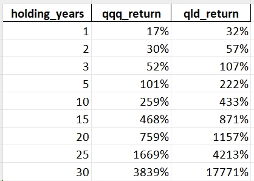
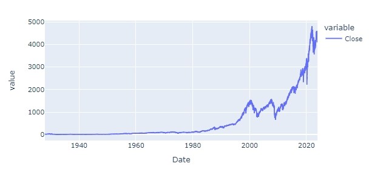
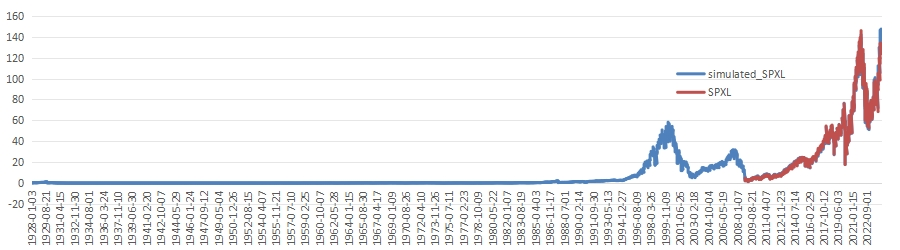
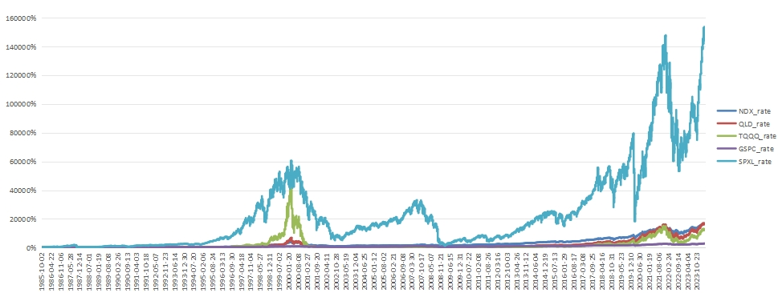

## Simulating leveraged Nasdaq 100

### qqq vs qld return by years

### nasdaq 100 vs us property 30 year return

### nasdaq 100 vs california property 30 year return

### x1

### x2

### x3

## Simulating leveraged SP500

### x1

### x2

### x3

# nasdaq 100 2x and 3x leveraged ETF simulation 

## ratio of holding x years

## return 

## return of all ETFs

